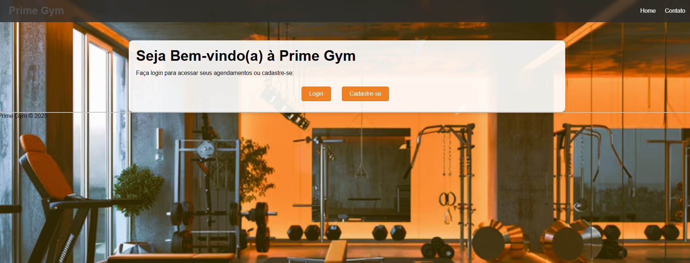
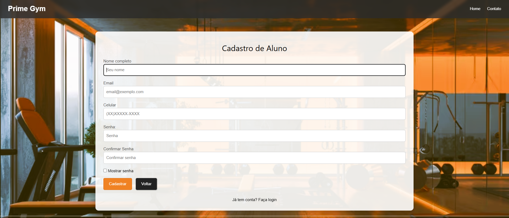
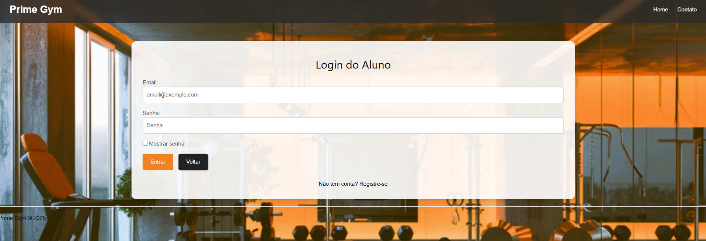
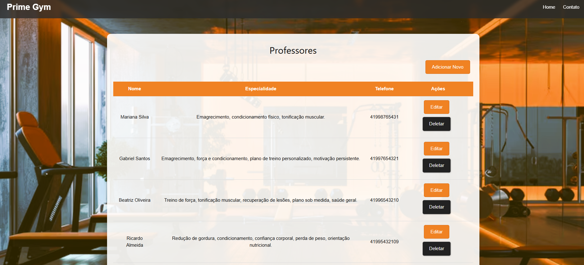
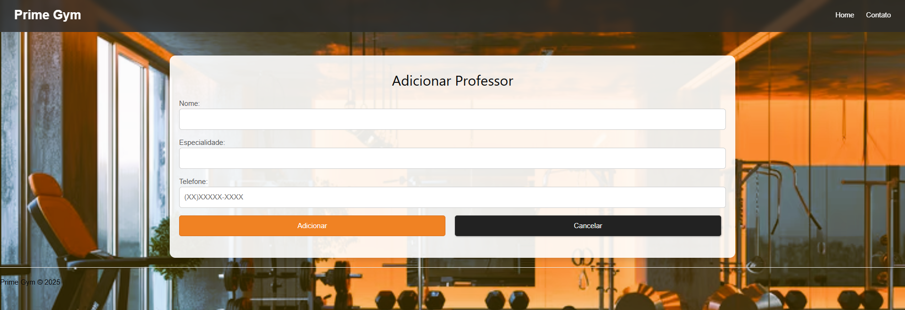
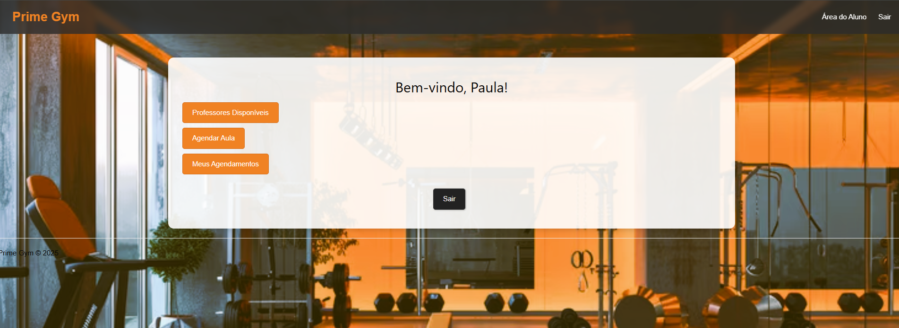
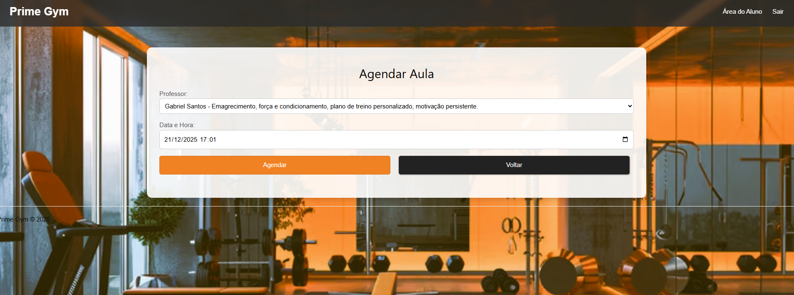
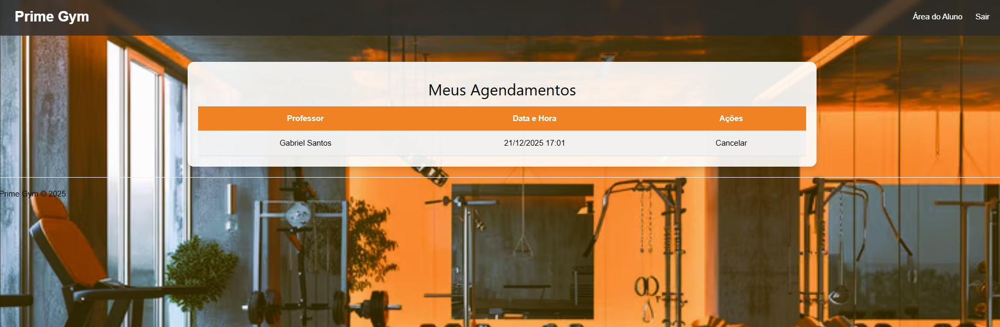

PrimeGym – Web System for Gyms (PHP + MySQL)

PrimeGym is a complete web-based gym management system built using PHP, MySQL, HTML, CSS, and JavaScript.
It includes features such as user authentication, teacher management, class scheduling, password validation, and a modern responsive interface.

About the Project
PrimeGym is a web management system designed to simplify the daily operations of gyms and training centers.

The system includes:

✔ Secure student login

✔ Teacher registration and management

✔ Class scheduling with conflict detection

✔ Responsive layout

✔ Strong password validation

✔ Phone number masking

✔ Student dashboard with upcoming classes

Features
Costumer Module

Register with email, phone, and strong password

Login using hashed passwords

Teacher Module
List all teachers
Add teacher
Edit teacher information
Delete teacher
Clean and responsive UI

Scheduling System

Choose a teacher
Select date and time
Prevents overlapping classes
Displays all scheduled classes for the logged-in student
Cancel classes with verification

Contact Page
Includes:
Address
Email
Phone
Business hours

Technologies Used
Frontend
HTML5
CSS3
W3.CSS
JavaScript (Vanilla)
Backend
PHP 7+
MySQLi

Sessions for authentication
Secure password hashing
Database
MySQL

Installation & Setup
1. Clone the repository
git clone https://github.com/your-username/PrimeGym_php.git

2. Create the MySQL database
Create a database named:
academia_db
Then import or create the necessary tables.

3. Configure database connection
Edit bd/conexao_db.php:

<?php
$host = "localhost"; 
$user = "root";
$pass = ""; 
$db = "academia_db";

$conn = mysqli_connect($host, $user, $pass, $db);

if (!$conn) {
    die("Connection failed: " . mysqli_connect_error());
}
?>

4. Start the system
Move the project to your server root (XAMPP/WAMP):
htdocs/PrimeGym_php
Open in browser:

http://localhost/PrimeGym_php/

Frontend
style.css
Includes:
Color palette using :root
Responsive navigation bar
Styled forms and buttons
Translucent card containers
Modern tables
Background image with fixed effect

script.js
Includes:
✔ Password show/hide
✔ Strong password validation
Regex requirements:
Minimum 8 characters
Uppercase
Lowercase
Number
Special character
✔ Phone number mask
Formats automatically:
(XX) XXXXX-XXXX
(XX) XXXX-XXXX

Backend
The backend handles:
Authentication using sessions
Password hashing and verification
CRUD operations for Teachers
Scheduling logic with conflict prevention
Secure output with htmlspecialchars()
Prepared statetents on delete operations

 License
This project is open for educational and personal use.
Commercial use requires permission from the author.
